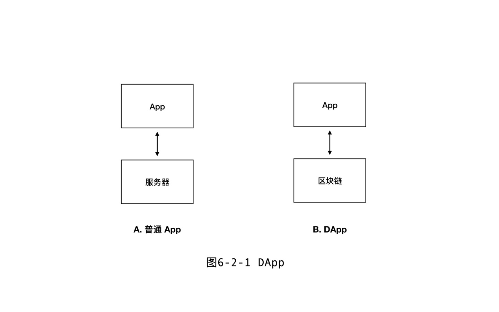

DApp 全称 Decentralized App, 中文翻译为去中心化应用。狭义的，以太坊智能合约视角下的 DApp 是这样定义的：DApp 就是基于智能合约的 App 。但是真让我详细点说，发现头绪角度很多的，因为智能合约本身其实就可以应用于各个领域的。这节我会努力给大家讲清楚以太坊世界观下的 DApp 的三个最重要的特点。分别是，第一基于智能合约，第二去中心化的游戏规则，第三有代币激励。掌握了这三个点，DApp 区别于传统 App 的最重要的特征也就掌握了。

## 基于智能合约

先来说第一点，基于智能合约。传统 App 是跟自己的后端服务器进行交互，而 DApp 从前端来讲其实也跟 App 一样，比如都可以做成 H5 Web 应用，或者可以做成各个平台的原生 App ，但是重点是 DApp 的后端不是自己的服务器，而是智能合约。

比如当前一个典型的 DApp 开发，是这样一个过程。首先开发前端，目前基于原生技术开发还比较少见，很多 DApp 前端都是用 H5 技术开发的，主要开发语言就是 Javascript 了。而后端就是一个智能合约，需要部署到类似于以太坊这样的区块链上。智能合约目前最流行的开发语言还是诞生于以太坊社区的 Solidity ，虽然以太坊之后的很多智能合约平台都跟以太坊有一定的竞争关系，但是以太坊上确立的很多东西，也大都成为了业界标准。

可以说 DApp 的本质就是智能合约，DApp 的前端部分只是给智能合约提供了一个美观友好的界面，方便用户操作和使用智能合约。

## 去中心化的游戏规则

智能合约最核心的思想就是去中心化。所以咱们下面来介绍 DApp 区别于传统 App 的第二个特点，就是去中心化的游戏规则。

要达成“去中心化”首先一个要求就是规则透明。DApp 的核心是智能合约，智能合约是部署到区块链上的代码，所以整个执行过程都是对所有人透明的，所有人都知道发生了什么，这是共识产生的基本条件。对于前端代码，原则上也应该是开放源码的，所有参与者都可以去查看每一行的代码。最大的透明度保证的是最大的共识，而 DApp 最强大的地方就是能吸引很多人放心的参与进来，因为大家知道这个游戏是公平的。

DApp 的运营也是去中心化的。理想条件下，DApp 不应该被一个商业公司所主导，至少利益的分配是对全部参与者都公平的。DApp 的背后应该是一个社区去主导，所有最重要的决定都是大家投票表决，社区中也会选举出开发和运营团队，但是他们除了根据贡献获得相应的收益之外，不应该享有特权。DApp 条件下不会严格区分，公司和客户，大家理论上都是用户，都是贡献者，也不会有个大老板，把项目赚到的钱全部归自己。

有了上面所说的代码透明以及项目运营的透明，DApp 就实现了去中心化的游戏规则。

## 有代币激励

DApp 的第三个特点，也是跟普通 App 区别非常大的一个特点，就是有代币激励。

代币分两种。一种是类似于比特币的系统原生币，比如以太币，这种币一般英文叫 coin 。这种币在 DApp 发挥的作用就是钱。比如一个 DApp 游戏中，就可以直接用以太币去购买装备。或者另外一个非常知名的 DApp 是 Steemit.com ，用户在上面生产内容，就会收到代币奖励。另外一种跟原生币不同，不是区块链自带的，而是基于区块链上的智能合约去生成的代币，英文中一般叫 token ，token 可以用来对应其他资产。比如，一个做二手车交易的 DApp ，就可以用 token 代表一辆车。代币本身是个大话题，我们这里就不展开了。但是，之所以一串数字能让大家认为具有价值，本身还是因为区块链和智能合约带来的数据的公开性和不可篡改性。

这里我想强调的是，每个用户在使用 DApp 的时候，如果需要进行代币转账，那么肯定是需要用自己的私钥进行签名的。如果每次转账都需要用户输入私钥，那么就会很麻烦了。一般的做法是，私钥保存在手机上的一个独立的钱包软件中，不会保存在 DApp 中，所以就需要钱包协助 DApp 签名。一种做法是，把钱包安装在浏览器中，例如 MetaMask ，这样当 DApp 运行在浏览器中，就可以跟钱包配合进行签名操作了。另外一种思路是安装一个手机上的原生钱包应用，然后让 DApp 运行在钱包里面，这样也能完成签名操作。

这就是我们要聊的第三点了，也就是代币激励。这是 DApp 和普通 App 的一个非常大的区别，相当于给 App 增加了一个经济激励层，会给游戏规则带来显著的变化。

## 总结

什么是 DApp 这节，主要内容就是这些了。网上看到一句话说：DApp是技术进化的下一个合乎逻辑的步骤。我觉得非常的有道理，区块链带来的人们的共识和数据的公开不可篡改，在这个基础上不依赖于人来执行的智能合约成为了可能，于是一切 App 的底层规则也就变了，所以未来的很多 App 都会被改写为 DApp 。最后重复一下以太坊愿景下的 DApp 的三个最明显的特征，第一个是基于智能合约，第二个是去中心化的游戏规则，第三个是有代币激励。本书中的 DApp 思路，会有一些差别，下一节会介绍到。
